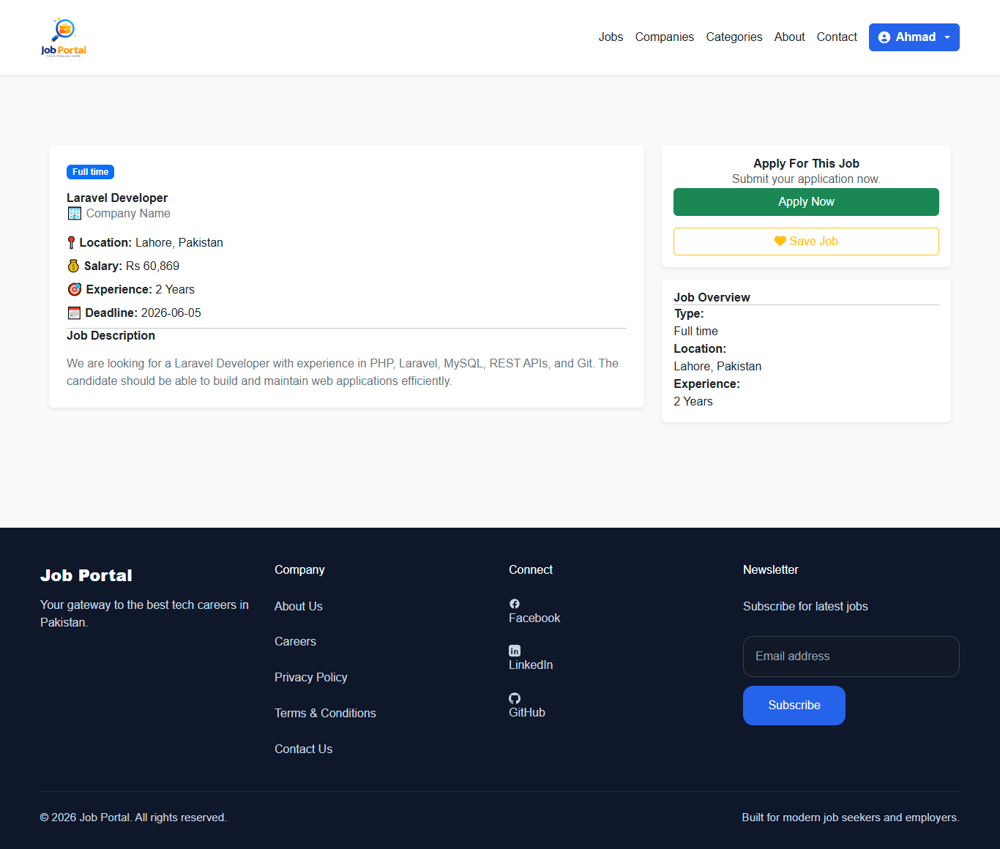
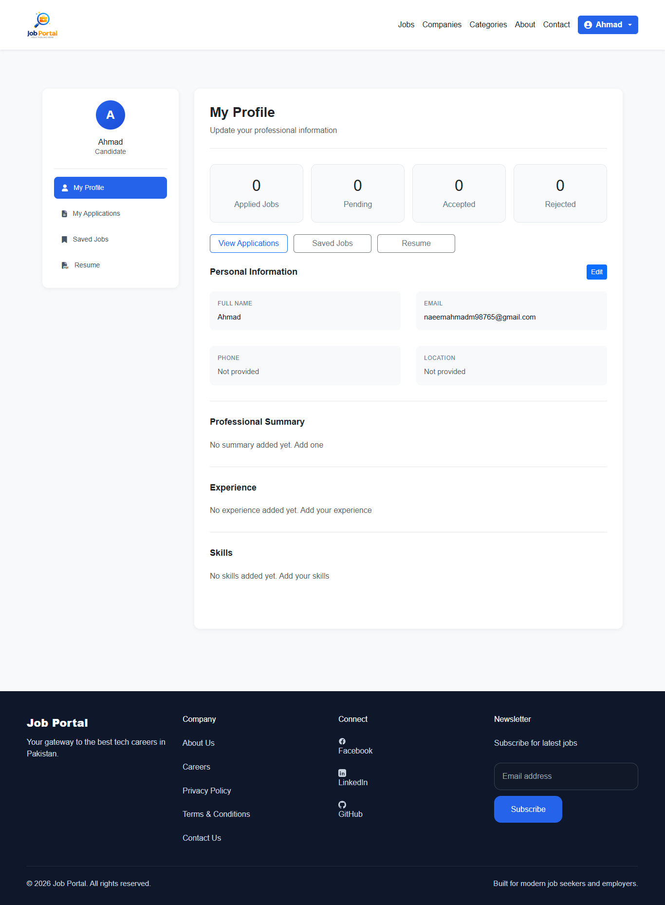
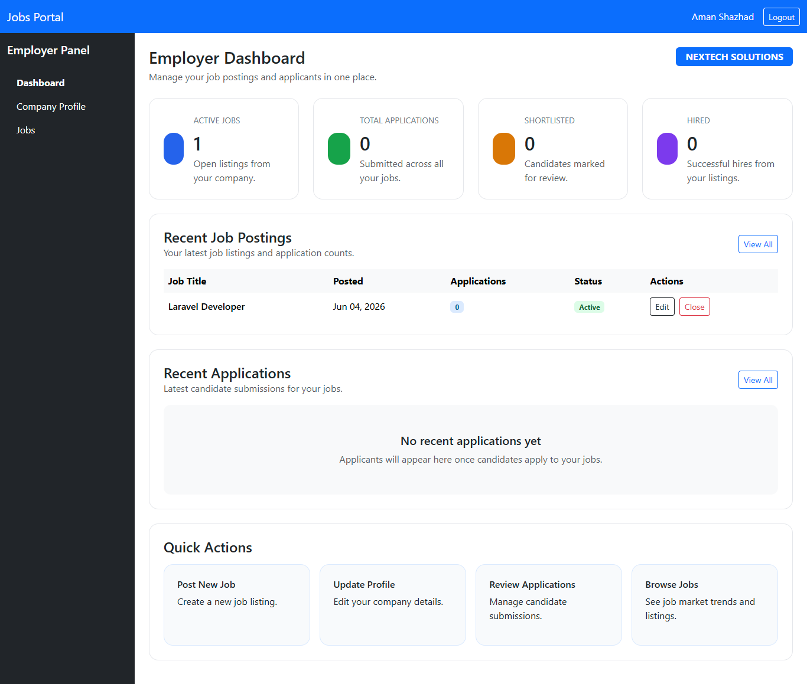
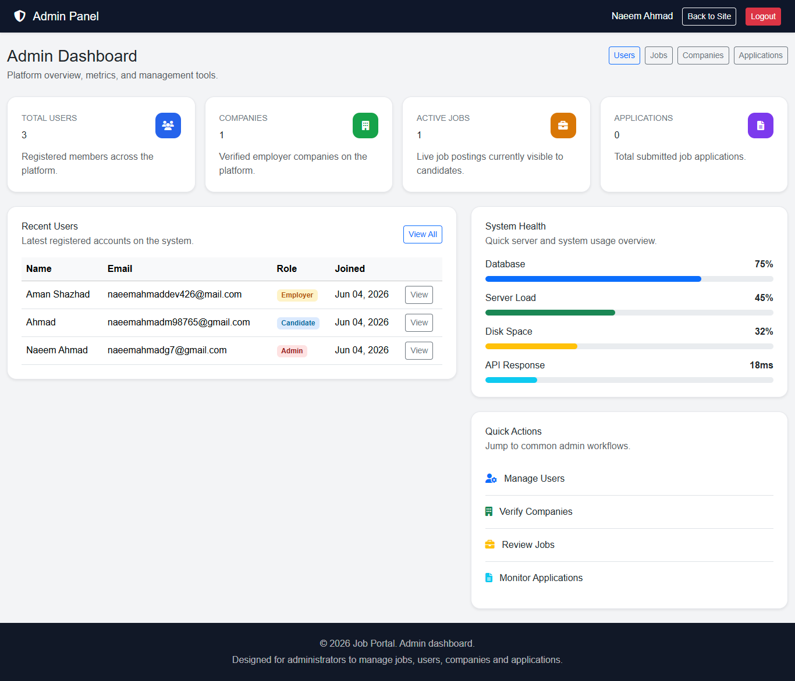

# 🚀 Job Portal

A modern and responsive Job Portal built with Laravel 12, PHP, MySQL, Bootstrap 5, and Vite.

This platform allows candidates to search and apply for jobs, employers to post and manage jobs, and administrators to manage the entire recruitment system.

---

## ✨ Features

### 👨‍💼 Candidate Panel

- User Registration & Login
- Browse Available Jobs
- Job Search & Filters
- View Job Details
- Apply for Jobs
- Upload Resume / CV
- Manage Profile
- Track Applications
- Save Favorite Jobs

---

### 🏢 Employer Panel

- Create Company Profile
- Post New Jobs
- Edit & Delete Jobs
- Manage Job Listings
- View Applicants
- Download Candidate CVs

---

### 👨‍💻 Admin Panel

- Dashboard Statistics
- Manage Users
- Manage Companies
- Manage Jobs
- Manage Applications
- Monitor Platform Activity

---

## 🛠 Tech Stack

| Technology | Version |
|------------|----------|
| Laravel | 12 |
| PHP | 8.2+ |
| MySQL | Latest |
| Bootstrap | 5 |
| Vite | Latest |
| Git | Version Control |

---

## 📸 Screenshots

### Home Page


### Jobs Listing


### Job Details



### Candidate Dashboard



### Employer Dashboard



### Admin Dashboard



---

## ⚙️ Installation

### Clone Repository

```bash
git clone https://github.com/USERNAME/jobs_portal.git
```

### Move Into Project

```bash
cd jobs_portal
```

### Install Dependencies

```bash
composer install
npm install
```

### Configure Environment

```bash
cp .env.example .env
```

### Generate Application Key

```bash
php artisan key:generate
```

### Run Migrations

```bash
php artisan migrate
```

### Create Storage Link

```bash
php artisan storage:link
```

### Start Server

```bash
php artisan serve
```

### Run Vite

```bash
npm run dev
```

---

## 📂 Project Structure

```text
app/
bootstrap/
config/
database/
public/
resources/
routes/
storage/
tests/
```

---

## 🎯 Future Improvements

- Email Notifications
- Job Recommendations
- Interview Scheduling
- Resume Builder
- AI Powered Job Matching

---

## 👤 Author

**Naeem Ahmad**

Laravel Developer

GitHub:
https://github.com/naeemahmaddev426

---

## 📄 License

This project is open-source and available under the MIT License.
